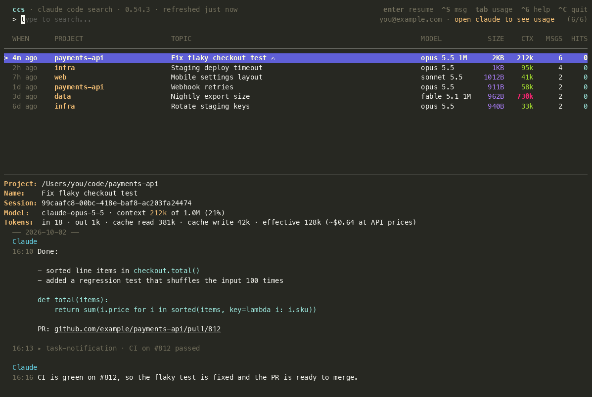

# ccs - Claude Code Search

[](https://github.com/agentic-utils/ccs/actions/workflows/test.yaml)
[](https://github.com/agentic-utils/ccs/releases/latest)
[](LICENSE)

Globally search and resume [Claude Code](https://claude.ai/claude-code) conversations.

[](https://asciinema.org/a/JXHQVf8PGBG2Orsl)

## Features

- Search through all your Claude Code conversations
- See session names (your custom titles or Claude's auto-generated ones) in the list
- Preview conversation context with search term highlighting
- See context size (tokens as of the last reply), message counts, hit counts, and file size per conversation
- Resume conversations directly from the search interface
- Auto-refreshes every minute; a green `●` marks conversations open in a running `claude`, a `⚙` marks ones started by a script, `claude -p` or a team lead
- Rename conversations (`Ctrl+R`)
- Delete conversations with confirmation prompt
- Prune bloated conversations losslessly (`ccs prune`)
- Pass flags through to `claude` (e.g., `--plan`)
- Usage screen (`Tab`): the last 12 hours of token usage across all sessions (including subagents) as three charts (cache-write disposition, context assembly, output), a summary with effective tokens, and your live 5-hour and weekly allowance. The allowance reads Claude Code's stored login read-only (macOS Keychain, else `~/.claude/.credentials.json`); ccs never refreshes or writes it, so if it has expired, open `claude` to refresh it
- Checks for new releases at startup and every 2 minutes (update steps are logged to `~/Library/Logs/ccs/update.log`) and offers to update and restart from a popup (via `brew upgrade` for Homebrew installs, otherwise by replacing the binary with the checksum-verified release)

## Installation

### Homebrew (macOS and Linux)

```bash
brew install agentic-utils/tap/ccs
```

### From source

Requires [Go](https://go.dev/doc/install) 1.24+.

```bash
go install github.com/agentic-utils/ccs@latest
```

### Manual

Download the binary from [releases](https://github.com/agentic-utils/ccs/releases) and add to your PATH.

## Requirements

- [Claude Code](https://claude.ai/claude-code) - must be installed and used at least once

## Usage

```bash
# Search recent conversations (last 60 days, files <1GB)
ccs

# Search with initial query
ccs buyer

# Search last 7 days only
ccs --max-age=7

# Search everything (all time, all files)
ccs --all

# Resume with plan mode
ccs -- --plan

# Combined: search "buyer", resume with plan mode
ccs buyer -- --plan
```

### Flags

| Flag | Default | Description |
|------|---------|-------------|
| `--max-age=N` | 60 | Only search files modified in the last N days (0 = no limit) |
| `--max-size=N` | 1024 | Max file size in MB to include (0 = no limit) |
| `--all` | - | Include everything (same as `--max-age=0 --max-size=0`) |
| `--exclude=a,b` | observer-sessions | Exclude project dirs whose path contains any of these substrings |

### Keybindings

- `↑/↓` or `Ctrl+P/N` - Navigate list
- `Enter` - Resume selected conversation, or jump to its iTerm tab / tmux pane if it's already open in `claude`
- `Ctrl+F` - Fork selected conversation (`claude --resume <id> --fork-session`)
- `Ctrl+D` - Delete selected conversation (with confirmation)
- `Ctrl+R` - Rename selected conversation (not while it's open in `claude`; use `/rename` there)
- `Ctrl+X` - Prune selected conversation - shrink it losslessly (with confirmation; not while it's open in `claude`)
- `Ctrl+J/K` - Scroll preview
- Mouse wheel - scrolls whatever is under the pointer (the conversation or the list); click a session to select it. Hold `⌥ Option` while dragging to select text in iTerm
- `Ctrl+U` - Clear search
- `Esc` - Clear the search
- Message box - select an open (`●`) session with the arrows (typing moves into the box under its conversation), or press `Ctrl+S` to jump into it; `Enter` sends (through Claude Code's message socket, or typed into its iTerm tab / tmux pane if the socket isn't reachable), `Esc` returns to the search
- `Tab` - Switch between the session list and the usage screen
- `Ctrl+O` - Switch Claude account (needs [cswap](https://github.com/realiti4/claude-swap), e.g. `uv tool install claude-swap`); clicking the account email does the same
- `Ctrl+G` - Show every shortcut (the header lists only the common ones, in compact form: `^S` for Ctrl+S)
- `Ctrl+L` - Changelog: what changed in each recent release, newest first, the installed and newer ones marked; scroll with ↑↓, PgUp/PgDn or the wheel
- `Ctrl+]` / `Ctrl+\` - With a search typed, jump to the next / previous matching message in the conversation (wraps round); the preview shows `hit 2/5`
- `Ctrl+C` - Quit

## Pruning

Conversation files grow large over time. `ccs prune` shrinks them by removing data that duplicates content kept elsewhere, so pruned conversations still resume with their full dialogue intact:

- `toolUseResult` fields - a copy of the tool result already present in `message.content`
- `file-history-snapshot` lines - rewind/checkpoint backups (pruning loses rewind history, not the conversation)

User and assistant messages are never modified, and a file is only rewritten if its conversation line count is unchanged.

`ccs prune` is a dry-run preview by default - it only reports what it would reclaim. Pass `--apply` to actually rewrite the files.

```bash
ccs prune                       # preview savings, change nothing (files >= 50MB)
ccs prune --apply               # prune after a confirmation prompt
ccs prune --apply --min-size=200  # only files >= 200MB
ccs prune --apply --no-tool-results  # keep tool results, only drop snapshot backups
```

Run `ccs prune --help` for all flags.

You can also prune a single conversation from the search interface: select it and press `Ctrl+X` (with confirmation).

## How it works

ccs reads conversation history from `~/.claude/projects/` and presents them in an interactive TUI. Live sessions come from `~/.claude/sessions/<pid>.json`, counted only while that pid is still running. When you select a conversation, it changes to the original project directory and runs `claude --resume <session-id>`.

## License

MIT
